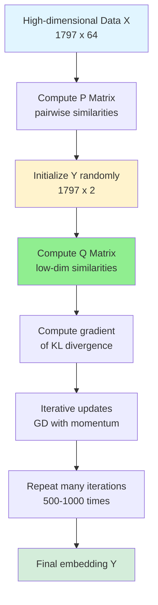
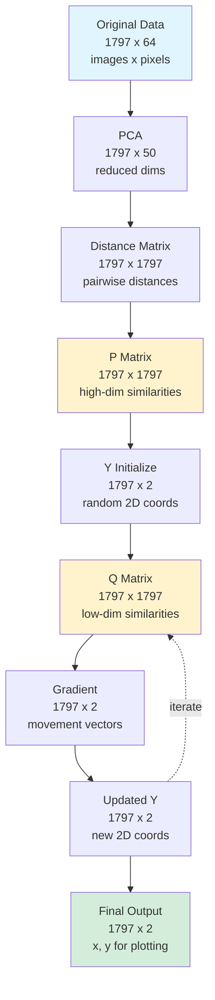

# t-SNE Algorithm Flow Diagram

## Data Flow

---

```mermaid
flowchart TD
    A[Input: High-Dimensional Data<br/>X: 1797 samples x 64 features<br/>Example: Digit images] --> B[Step 1: PCA Preprocessing]
    B --> C[Reduced Data<br/>X: 1797 x 50<br/>Less noise, faster processing]
    C --> D[Step 2: Compute P Matrix<br/>High-dimensional similarities]
    D --> E[P Matrix: 1797 x 1797<br/>P i,j = how similar i and j are<br/>Example: P 0,1 = 0.023]
    E --> F[Step 3: Initialize Y Randomly<br/>2D positions]
    F --> G[Y: 1797 x 2<br/>Random coordinates<br/>Example: Y 0 = 0.23, -0.45]
    G --> H{Optimization Loop<br/>500-1000 iterations}
    H --> I[Step 4a: Compute Q Matrix<br/>Current 2D similarities]
    I --> J[Q Matrix: 1797 x 1797<br/>Q i,j = current similarity in 2D]
    J --> K[Step 4b: Compute Gradient<br/>Direction to move points]
    K --> L[Gradient dY: 1797 x 2<br/>Movement vectors<br/>Example: dY 0 = 0.15, -0.23]
    L --> M[Step 4c: Update Positions<br/>Y = Y + momentum * velocity - lr * gradient]
    M --> N[Updated Y: 1797 x 2<br/>Points moved to better positions]
    N --> O{Converged?<br/>iter less than max_iter}
    O -->|No| H
    O -->|Yes| P[Output: Final 2D Embedding<br/>Y: 1797 x 2<br/>Ready to visualize!]
    
    style A fill:#e1f5ff
    style P fill:#d4edda
    style E fill:#fff3cd
    style G fill:#fff3cd
    style J fill:#fff3cd
    style N fill:#f8d7da
```

## Function Flow

```mermaid
flowchart TD
    X1[Input: X<br/>1797 x 64] --> PCA[PCA Preprocessing<br/>Center data & project]
    PCA --> X2[X reduced<br/>1797 x 50]
    
    X2 --> D1[pairwise_distances<br/>Compute Xi - Xj squared]
    D1 --> D2[Distance Matrix D<br/>1797 x 1797]
    
    D2 --> Loop1[x2p: For each point i<br/>Loop 1797 times]
    Loop1 --> Extract[Extract Di<br/>n-1 distances excluding self]
    Extract --> BinSearch{Binary search<br/>for beta}
    
    BinSearch --> Gaussian[Apply Gaussian<br/>P = exp-Di * beta]
    Gaussian --> Normalize[Normalize<br/>P = P / sum P]
    Normalize --> Entropy[Calculate entropy H]
    Entropy --> Check{H matches<br/>log perplexity?}
    
    Check -->|No: Adjust beta| BinSearch
    Check -->|Yes| Store[Store probability row<br/>in P matrix]
    Store --> MorePoints{More<br/>points?}
    MorePoints -->|Yes| Loop1
    MorePoints -->|No| P[P Matrix Complete<br/>1797 x 1797<br/>High-dim similarities]
    
    P --> Symmetrize[Symmetrize P<br/>P = P + P.T / 2]
    Symmetrize --> Init[Initialize Y randomly<br/>1797 x 2]
    
    Init --> OptLoop{Optimization Loop<br/>max_iter iterations}
    OptLoop --> Dist2D[Compute 2D distances<br/>from current Y positions]
    Dist2D --> StudentT[Apply Student-t kernel<br/>1 / 1 + distance squared]
    StudentT --> Q[Q Matrix<br/>1797 x 1797<br/>Current 2D similarities]
    
    Q --> Compare[Compare P vs Q<br/>PQ = P - Q]
    Compare --> Gradient[Compute gradient dY<br/>For each point: weighted sum]
    Gradient --> Update[Update positions<br/>Y = Y + momentum * iY - lr * dY]
    Update --> Recenter[Re-center Y<br/>Y = Y - mean Y]
    Recenter --> YNew[Updated Y<br/>1797 x 2]
    
    YNew --> IterCheck{More<br/>iterations?}
    IterCheck -->|Yes| OptLoop
    IterCheck -->|No| Final[Final Embedding<br/>Y: 1797 x 2<br/>Ready to plot!]
    
    style X1 fill:#e1f5ff
    style D2 fill:#fff3cd
    style P fill:#fff3cd
    style Q fill:#fff3cd
    style YNew fill:#f8d7da
    style Final fill:#d4edda
```

## Data Shape Transformations

## Key Concepts

### What is P Matrix?
- **Size**: n x n (e.g., 1797 x 1797)
- **Meaning**: P[i,j] = similarity between point i and point j in **high dimensions**
- **Example Values**: 
  - P[0,1] = 0.023 → points 0 and 1 are somewhat similar
  - P[0,5] = 0.001 → points 0 and 5 are very different
  - Diagonal is 0 (point not similar to itself)

### What is Q Matrix?
- **Size**: n x n (e.g., 1797 x 1797)
- **Meaning**: Q[i,j] = similarity between point i and point j in **2D space**
- **Goal**: Make Q match P through optimization

### What is Y?
- **Size**: n x 2 (e.g., 1797 x 2)
- **Meaning**: 2D coordinates for each data point
- **Example**: Y[0] = [12.3, -5.7] means point 0 is at position (12.3, -5.7)
- **Evolution**: Starts random, becomes meaningful after optimization

### What is the Gradient?
- **Size**: n x 2 (e.g., 1797 x 2)
- **Meaning**: Direction to move each point to make Q closer to P
- **Example**: dY[0] = [0.15, -0.23] means move point 0 right (+0.15) and down (-0.23)
