```mermaid
flowchart TD
    X1[Input: X<br/>1797 x 64] --> PCA[PCA Preprocessing<br/>Center data & project]
    PCA --> X2[X reduced<br/>1797 x 50]
    
    X2 --> D1[pairwise_distances<br/>Compute Xi - Xj squared]
    D1 --> D2[Distance Matrix D<br/>1797 x 1797]
    
    D2 --> Loop1[x2p: For each point i<br/>Loop 1797 times]
    Loop1 --> Extract[Extract Di<br/>n-1 distances excluding self]
    Extract --> BinSearch{Binary search<br/>for beta}
    
    BinSearch --> Gaussian[Apply Gaussian<br/>P = exp-Di * beta]
    Gaussian --> Normalize[Normalize<br/>P = P / sum P]
    Normalize --> Entropy[Calculate entropy H]
    Entropy --> Check{H matches<br/>log perplexity?}
    
    Check -->|No: Adjust beta| BinSearch
    Check -->|Yes| Store[Store probability row<br/>in P matrix]
    Store --> MorePoints{More<br/>points?}
    MorePoints -->|Yes| Loop1
    MorePoints -->|No| P[P Matrix Complete<br/>1797 x 1797<br/>High-dim similarities]
    
    P --> Symmetrize[Symmetrize P<br/>P = P + P.T / 2]
    Symmetrize --> Init[Initialize Y randomly<br/>1797 x 2]
    
    Init --> OptLoop{Optimization Loop<br/>max_iter iterations}
    OptLoop --> Dist2D[Compute 2D distances<br/>from current Y positions]
    Dist2D --> StudentT[Apply Student-t kernel<br/>1 / 1 + distance squared]
    StudentT --> Q[Q Matrix<br/>1797 x 1797<br/>Current 2D similarities]
    
    Q --> Compare[Compare P vs Q<br/>PQ = P - Q]
    Compare --> Gradient[Compute gradient dY<br/>For each point: weighted sum]
    Gradient --> Update[Update positions<br/>Y = Y + momentum * iY - lr * dY]
    Update --> Recenter[Re-center Y<br/>Y = Y - mean Y]
    Recenter --> YNew[Updated Y<br/>1797 x 2]
    
    YNew --> IterCheck{More<br/>iterations?}
    IterCheck -->|Yes| OptLoop
    IterCheck -->|No| Final[Final Embedding<br/>Y: 1797 x 2<br/>Ready to plot!]
    
    style X1 fill:#e1f5ff
    style D2 fill:#fff3cd
    style P fill:#fff3cd
    style Q fill:#fff3cd
    style YNew fill:#f8d7da
    style Final fill:#d4edda
```

# t-SNE Implementation from Scratch

This repository contains a Python implementation of the t-Distributed Stochastic Neighbor Embedding (t-SNE) algorithm, designed to reduce high-dimensional data to 2D for visualization.

## Algorithm Flow

The following diagram illustrates the step-by-step process implemented in `tsne.py`, including data shapes and key transformations.

## Key Concepts

- **P Matrix (High-dim)**: Represents similarity in the original space. $P_{ij}$ is the probability that point $i$ chooses $j$ as a neighbor. Computed using Gaussian kernels with perplexity-based variance.
- **Q Matrix (Low-dim)**: Represents similarity in the 2D embedding. $Q_{ij}$ uses a Student-t distribution (heavier tails) to handle the "crowding problem".
- **Optimization**: The algorithm minimizes the Kullback-Leibler (KL) divergence between P and Q using Gradient Descent with momentum.
