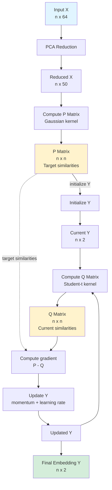

# t-SNE Implementation from Scratch

This repository contains a Python implementation of the t-Distributed Stochastic Neighbor Embedding (t-SNE) algorithm, designed to reduce high-dimensional data to 2D for visualization.

## Algorithm Flow

The following diagram illustrates the step-by-step process implemented in `tsne.py`, including data shapes and key transformations.

## Key Concepts

- **P Matrix (High-dim)**: Represents similarity in the original space. $P_{ij}$ is the probability that point $i$ chooses $j$ as a neighbor. Computed using Gaussian kernels with perplexity-based variance.
- **Q Matrix (Low-dim)**: Represents similarity in the 2D embedding. $Q_{ij}$ uses a Student-t distribution (heavier tails) to handle the "crowding problem".
- **Optimization**: The algorithm minimizes the Kullback-Leibler (KL) divergence between P and Q using Gradient Descent with momentum.

## Kernel Definitions

### Gaussian Kernel (High-dimensional P)

Converts squared distances $d_{ij}$ into conditional probabilities using bandwidth $\sigma$ (or precision $\beta = 1/\sigma^2$):

$$d_{ij} = \|x_i - x_j\|^2$$

$$\beta = \frac{1}{\sigma^2}$$

$$p_{j|i} = \frac{\exp(-\beta \cdot d_{ij})}{\sum_{k \neq i} \exp(-\beta \cdot d_{ik})}$$

Rows are tuned so that the entropy $H(p_{\cdot|i}) = \log(\text{perplexity})$.

### Student-t Kernel (Low-dimensional Q)

Uses a heavy-tailed similarity in the embedding:

$$f_{ij} = \left(1 + \|y_i - y_j\|^2\right)^{-1}$$

$$q_{ij} = \frac{f_{ij}}{\sum_{a \neq b} f_{ab}}, \quad q_{ii} = 0$$

This choice mitigates crowding by assigning non-negligible similarity to moderately distant points. The heavy tails ($q_{ij} \propto (1 + \|y_i - y_j\|^2)^{-1}$) weaken repulsion at larger distances and allow points to spread out, improving separation between clusters while preserving local neighborhoods.

