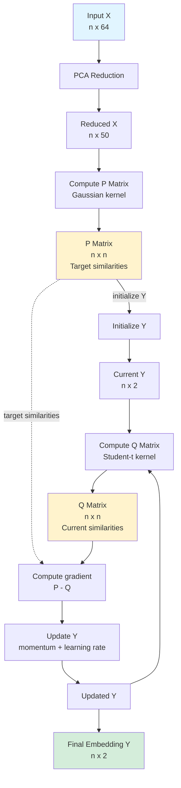
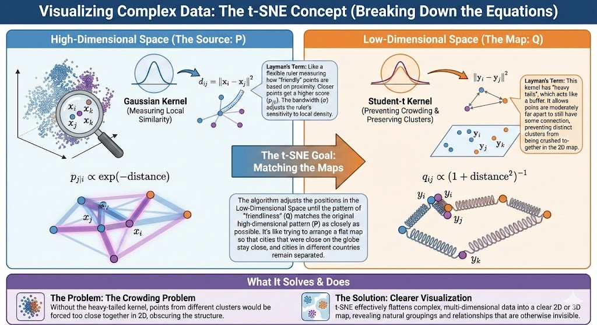
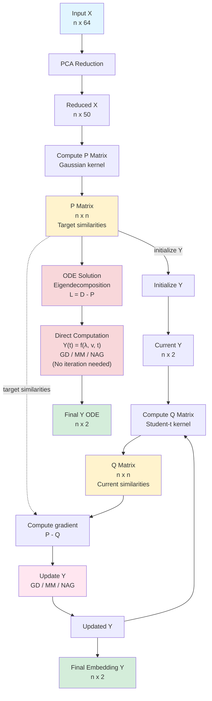

# t-SNE Implementation from Scratch

This repository contains a Python implementation of the t-Distributed Stochastic Neighbor Embedding (t-SNE) algorithm, designed to reduce high-dimensional data to 2D for visualization.

## Algorithm Flow

The following diagram illustrates the step-by-step process implemented in `tsne.py`, including data shapes and key transformations.

## Key Concepts

- **P Matrix (High-dim)**: Represents similarity in the original space. $P_{ij}$ is the probability that point $i$ chooses $j$ as a neighbor. Computed using Gaussian kernels with perplexity-based variance.
- **Q Matrix (Low-dim)**: Represents similarity in the 2D embedding. $Q_{ij}$ uses a Student-t distribution (heavier tails) to handle the "crowding problem".
- **Optimization**: The algorithm minimizes the Kullback-Leibler (KL) divergence between P and Q using Gradient Descent with momentum.

## Kernel Definitions

### Gaussian Kernel (High-dimensional P)

Converts squared distances $d_{ij}$ into conditional probabilities using bandwidth $\sigma$ (or precision $\beta = 1/\sigma^2$):

$$d_{ij} = \|x_i - x_j\|^2$$

$$\beta = \frac{1}{\sigma^2}$$

$$p_{j|i} = \frac{\exp(-\beta \cdot d_{ij})}{\sum_{k \neq i} \exp(-\beta \cdot d_{ik})}$$

Rows are tuned so that the entropy $H(p_{\cdot|i}) = \log(\text{perplexity})$.

### Student-t Kernel (Low-dimensional Q)

Uses a heavy-tailed similarity in the embedding:

$$f_{ij} = \left(1 + \|y_i - y_j\|^2\right)^{-1}$$

$$q_{ij} = \frac{f_{ij}}{\sum_{a \neq b} f_{ab}}, \quad q_{ii} = 0$$

This choice mitigates crowding by assigning non-negligible similarity to moderately distant points. The heavy tails ($q_{ij} \propto (1 + \|y_i - y_j\|^2)^{-1}$) weaken repulsion at larger distances and allow points to spread out, improving separation between clusters while preserving local neighborhoods.

---

### Review Note on a t-SNE Variant with Multiple Optimization Methods

The [`tsne-variant.py`](https://raw.githubusercontent.com/ISMHinoLab/Dynamics_of_the_accelerated_t-SNE/refs/heads/main/utils.py) (available at the linked URL (The original source code)), extends the basic implementation with three different optimization approaches and analytical ODE-based solutions.

### Key Differences Between Methods

| Method | Update Rule | Characteristics | ODE Solution |
|--------|-------------|-----------------|--------------|
| **GD** | $Y_{k+1} = Y_k + h \cdot \nabla$ | Pure gradient descent (no momentum) | $Y(t) = e^{-t\Lambda} Y_0$ |
| **MM** | $Y_{k+1} = Y_k + h \cdot \nabla + m(Y_k - Y_{k-1})$ | Adds momentum (classic `tsne.py` uses this) | Modified eigenvalues: $\lambda/(1-m)$ |
| **NAG** | Look-ahead gradient at $Y_{nes}$ | Nesterov acceleration, fastest convergence | Bessel functions: $J_1$, $I_1$ |

GD: Pure gradient descent without momentum  
MM: Gradient descent WITH momentum - this is what the classic `tsne.py` actually uses  
NAG: Nesterov accelerated gradient (fastest)  

### Important Note on ODE Solutions

⚠️ **The ODE-based solutions are NOT equivalent to t-SNE**. They solve a different problem:

- **Iterative methods (GD/MM/NAG)**: Minimize KL divergence between P (Gaussian) and Q (Student-t kernel). This is **actual t-SNE**.
- **ODE solutions**: Solve a linear graph Laplacian diffusion system (L = D - P) using eigendecomposition. This is closer to **spectral methods** like Laplacian Eigenmaps.

#### Why Include ODE Solutions?

The ODE approach is **NOT a practical alternative** to t-SNE, but a **theoretical analysis tool** to:

1. **Understand convergence behavior**: Deriving continuous-time differential equations from discrete updates reveals mathematical properties like convergence rates and stability conditions
2. **Explain acceleration**: Bessel function solutions for NAG show analytically why Nesterov momentum converges faster than standard momentum
3. **Bridge discrete and continuous**: Connects numerical optimization (discrete iterations) to dynamical systems theory (continuous flows)

#### Why "Continuous Flow"?

**Discrete (Iterative) Optimization:**
- Updates at discrete time steps: k = 0, 1, 2, 3, ...
- Positions jump at each iteration: $Y_k \rightarrow Y_{k+1}$
- Update rule: $Y_{k+1} = Y_k + h \cdot \nabla$ (discrete jumps)

**Continuous (ODE) Flow:**
- Time is continuous: t ∈ [0, ∞)
- Positions evolve smoothly: $Y(t)$ where t is a real number
- Governed by differential equation: $\frac{dY}{dt} = -\nabla F(Y)$
- Solution "flows" continuously along the vector field

**The Mathematical Connection:**

When you take the limit as step size h → 0 in the discrete updates:

$$Y_{k+1} = Y_k + h \cdot \nabla$$

becomes the **ordinary differential equation (ODE)**:

$$\frac{dY}{dt} = \nabla$$

This ODE describes how the system evolves continuously over time. The solution Y(t) flows smoothly through space following the gradient field—like water flowing along a stream—hence "continuous flow."

#### Key Limitations:

- Does **not** compute the Q matrix or use the Student-t kernel
- Produces **different embeddings** than iterative t-SNE (more like spectral/Laplacian methods)
- Uses **graph Laplacian**: L = D - P, where:
  - L = Laplacian matrix (captures graph structure)
  - D = Degree matrix (diagonal: D[i,i] = Σⱼ P[i,j])
  - P = Probability/similarity matrix (from high-dimensional space)
- **No efficiency advantage**: Eigendecomposition is O(n³), expensive for large datasets
- **For research/analysis only**: Use iterative methods (GD/MM/NAG) for actual t-SNE embeddings

